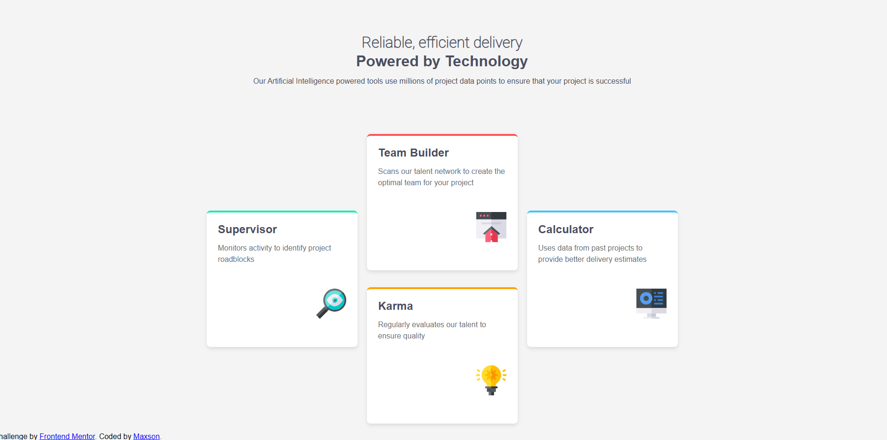

# Frontend Mentor - Four card feature section solution

This is a solution to the [Four card feature section challenge on Frontend Mentor](https://www.frontendmentor.io/challenges/four-card-feature-section-weK1eFYK). Frontend Mentor challenges help you improve your coding skills by building realistic projects.

## Table of contents

- [Overview](#overview)
  - [The challenge](#the-challenge)
  - [Screenshot](#screenshot)
  - [Links](#links)
- [My process](#my-process)
  - [Built with](#built-with)
  - [What I learned](#what-i-learned)
- [Author](#author)

## Overview

### The challenge

Users should be able to:

- View the optimal layout for the site depending on their device's screen size

### Screenshot

### Links

- Solution URL: https://github.com/Maxzi1/CSS-day-2.git
- Live Site URL: https://css-day-2-woad.vercel.app/

## My process

Test my skills first, then I polish with Google and Gemini.

### Built with

- Semantic HTML5 markup
- CSS custom properties
- CSS Grid
- Flexbox

### What I learned

- How to use CSS Grid for responsive layouts
- How to use Flexbox for aligning elements (e.g., positioning card images to the right)
- How to use custom properties and HSL colors for consistent styling

## Author

- Frontend Mentor - [@Maxzi1](https://www.frontendmentor.io/profile/Maxzi1)
